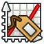
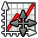

#  Plot

The Plot workbench provides some additional  
tools to modify Plots created within [FreeCAD].

![Preview]

 

## Tools

###  Save

Extended plot saving dialog with more options.

###  Axes

Modify axes ranges & scaling or add new ones. 

###  Series

Edit the style of series or remove them.

###  Grid

Enable / disable the grid of the plot.

###  Legend

Enable / disable the legend of the plot.

###  Labels

Set the plot title and axes labels.

###  Positions & Sizes

Resize and move plot elements  
like titles, labels and legends.

 

## Install

Install this addon via the Addon Manager.

## Usage

Documentation for this workbench is available on the [Plot Workbench wiki page](https://wiki.freecad.org/Plot_Workbench)

## Tutorials

* Official Plot Workbench Tutorial [Part 1](https://wiki.freecad.org/Plot_Basic_tutorial)
* Official Plot Workbench Tutorial [Part 2](https://wiki.freecad.org/Plot_MultiAxes_tutorial)

<!----------------------------------------------------------------------------->

[Icon-Positions]: freecad/plot/Resources/Icons/Positions.svg
[Icon-Labels]: freecad/plot/Resources/Icons/Labels.svg
[Icon-Series]: freecad/plot/Resources/Icons/Series.svg
[Icon-Legend]: freecad/plot/Resources/Icons/Legend.svg
[Icon-Grid]: freecad/plot/Resources/Icons/Grid.svg
[Icon-Axes]: freecad/plot/Resources/Icons/Axes.svg
[Icon-Save]: freecad/plot/Resources/Icons/Save.svg

[Preview]: Resources/Images/Preview-Toolbar.webp

[FreeCAD]: https://freecad.org
